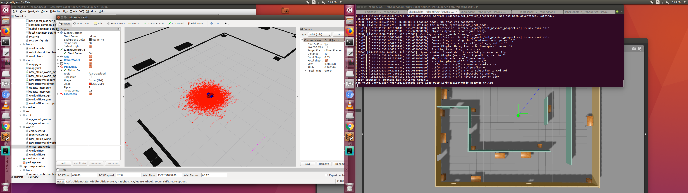
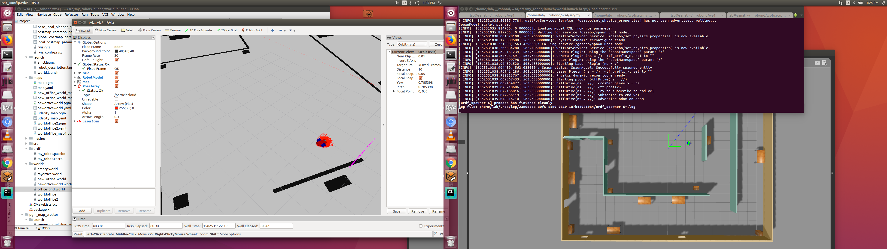
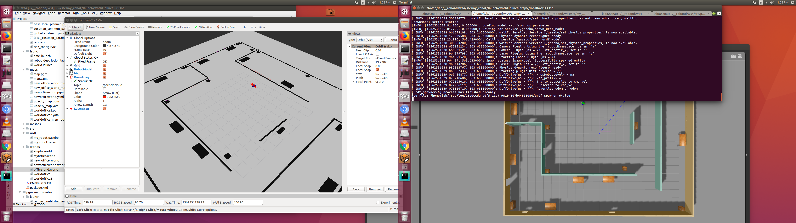
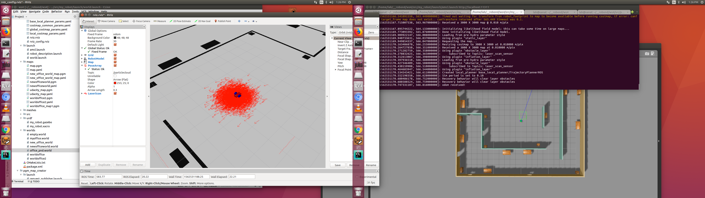
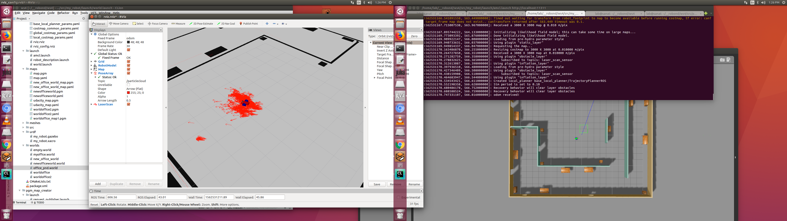
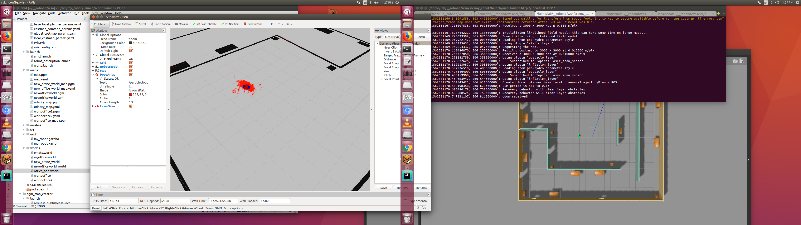
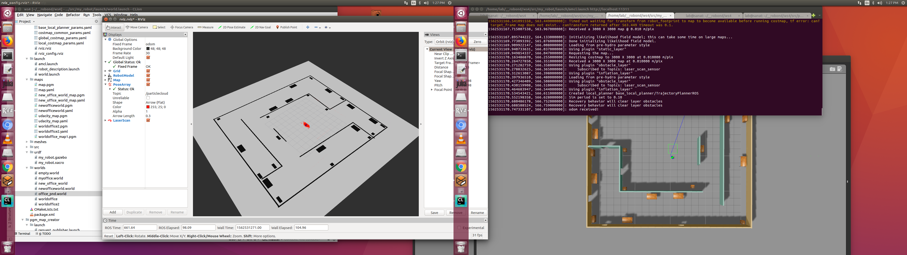

[](https://www.udacity.com/robotics)

#  where am I
## Project Overview

Welcome to the Where Am I? localization project! In this project, we will utilize ROS AMCL package to accurately localize a mobile 
robot inside a map in the Gazebo simulation environments.

we will learn aspects of robotic software engineering with a focus on ROS:

    Create a ROS package that launches a custom robot model in a custom Gazebo world

    Utilize the ROS AMCL package and the Tele-Operation / Navigation Stack to localize the robot

    Explore, add, and tune specific parameters corresponding to each package to achieve the best possible localization results


The robot you design in this project will be used as a base model for all your upcoming projects in this Robotics Software Engineer Nanodegree Program.
Evaluation
 

 The directory structure and contain all the files listed here:

    .ws4                          # where am I
     ├── src
     │  ├── my_robot                       # my_robot package                   
     │  │   ├── config                     # amc config pointcloud   
     │  │   │   ├── base_local_planner_params.yaml
     │  │   │   ├── costmap_common_params.yaml
     │  │   │   ├── global_costmap_params.yaml
     │  │   │   ├── local_costmap_params.yaml
     │  │   │   ├── rviz.rviz
     │  │   ├── launch                     # launch folder for launch files   
     │  │   │   ├── amcl.launch
     │  │   │   ├── robot_description.launch
     │  │   │   ├── world.launch
     │  │   ├── maps                     # map   
     │  │   │   ├── map.pgm
     │  │   │   ├── map.yaml
     │  │   │   ├── new_office_world_map.pgm
     │  │   │   ├── new_office_world_map.yaml
     │  │   │   ├── newofficeworld.pgm
     │  │   │   ├── newofficeworld.yaml
     │  │   │   ├── udacity_map.pgm
     │  │   │   ├── udacity_map.yaml
     │  │   │   ├── worldoffice2.pgm
     │  │   │   ├── worldoffice2.yaml
     │  │   │   ├── worldoffice_map1.pgm
     │  │   ├── src                        # source folder for C++ scripts
     │  │   │   ├── navigation_goal.cpp
     │  │   ├── meshes                     # meshes folder for sensors
     │  │   │   ├── hokuyo.dae
     │  │   ├── urdf                       # urdf folder for xarco files
     │  │   │   ├── my_robot.gazebo
     │  │   │   ├── my_robot.xacro
     │  │   ├── world                      # world folder for world files
     │  │   │   ├── empty.world
     │  │   │   ├── myoffice.world
     │  │   │   ├── new_office_world
     │  │   │   ├── newofficeworld.world
     │  │   │   ├── office_pnd.world
     │  │   │   ├── worldoffice
     │  │   │   ├── worldoffice2
     │  │   ├── CMakeLists.txt             # compiler instructions
     │  │   ├── package.xml                # package info
     │  ├── ball_chaser                    # ball_chaser package                   
     │  │   ├── launch                     # launch folder for launch files   
     │  │   │   ├── ball_chaser.launch
     │  │   ├── src                        # source folder for C++ scripts
     │  │   │   ├── drive_bot.cpp
     │  │   │   ├── process_images.cpp
     │  │   ├── srv                        # service folder for ROS services
     │  │   │   ├── DriveToTarget.srv
     │  │   ├── CMakeLists.txt             # compiler instructions
     │  │   ├── package.xml                # package info                  
     │  └──                              
     ├── my_ball                            # white ball
     │  └──   model.config
     │  └──   model.sdf
     ├── office_new_vertical                # office_new_vertical
     │  └──   model.config
     │  └──   model.sdf
     ├── better_office                      # better_office
     │  └──   model.config
     │  └──   model.sdf
     ├── office_pnd                         # office_pnd
     │  └──   model.config
     │  └──   model.sdf
     │  
     ├── images                            # results screen shots
     │  
     
      
     
     
     
## Contents
 

Note that some example snapshots of the robot simulator can be found inside the folder **images/**.

## Usage 

#### Step 1 

launch simulator. 
```
$ roslaunch my_robot world.launch
```
#### Step 2

Launch amcl with map server.

```
$  roslaunch my_robot amcl.launch
```

##  
#### amcl localization with '2d pose estimate' and '2d Nav Goal'


 

 

 

 
 






